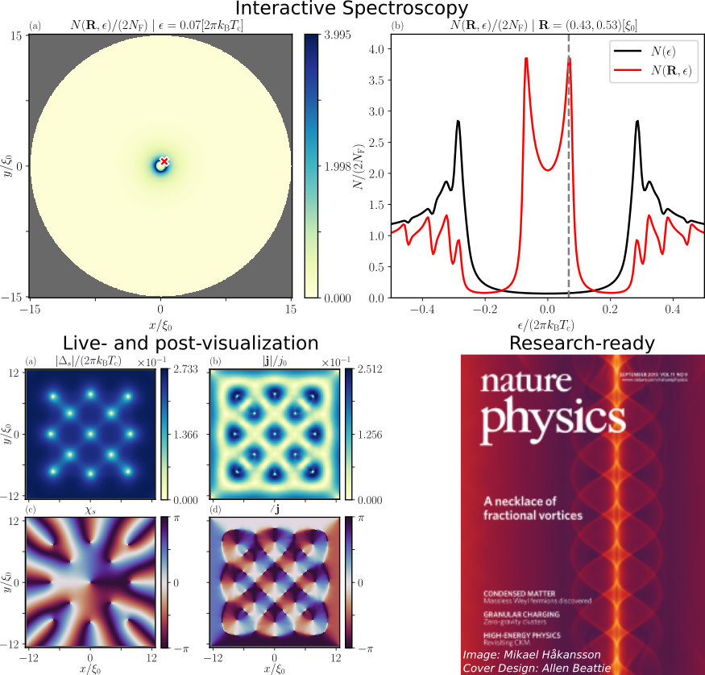

# SuperConga

[Niclas Wall Wennerdal](https://gitlab.com/niclas_wall_wennerdal), [Patric Holmvall](https://gitlab.com/Holmvall), [Mikael Håkansson](https://www.linkedin.com/in/mikael-h%C3%A5kansson-07549a1), [Pascal Stadler](https://gitlab.com/pascalsta), [Oleksii Shevtsov](https://gitlab.com/oshevtsov), [Tomas Löfwander](https://www.chalmers.se/en/staff/Pages/Tomas-L%C3%B6fwander.aspx), [Mikael Fogelström](https://www.chalmers.se/en/staff/Pages/Mikael-Fogelstr%C3%B6m.aspx)

SuperConga is an open-source framework for simulating the physics of superconducting and condensed-matter systems, specifically 2D mesoscopic grains in equilibrium, by using the quasiclassical theory of superconductivity. The core is written in C++ and CUDA, exploiting the parallel nature of quasiclassical Eilenberger theory, and utilizing the computational power of modern GPUs. SuperConga is available to use under the license agreements stated in [LICENSE.txt](https://gitlab.com/superconga/superconga/-/blob/master/LICENSE.txt), and it can be used on all Unix-based platforms. In addition, SuperConga has experimental support for running on AMD GPUs via HIP/ROCm.

**Backend:** The framework self-consistently solves for the superconducting order-parameter and the magnetic vector potential, and computes the the current density, magnetic induction, magnetic moment, free energy, as well as the local density of states. The simulations can be visualized in real-time with OpenGL.

**Frontend:** A user-friendly Python frontend is provided, making SuperConga easy to use without requiring a deep understanding of the underlying theory or implementation details. The user can setup relatively complex simulations via intuitive configuration files, or via command-line interface (CLI). Furthermore, the framework ships with simple and interactive tools for data analysis and visualization, making SuperConga ideal for both research and educational purposes.

**User manual:** An extensive user manual can be found in our [online documentation](https://superconga.gitlab.io/superconga-doc/), including tutorials and physics/research guides.

**Code paper:** ["SuperConga: An open-source framework for mesoscopic superconductivity"](https://doi.org/10.1063/5.0100324), Applied Physics Reviews 10, 011317 (2023). [](https://doi.org/10.1063/5.0100324)

---




# Table of contents

- [Download](#download)
- [Hardware requirements](#hardware)
- [Installing dependencies](#dependencies)
    - [Arch/Manjaro](#arch_manjaro)
    - [Ubuntu](#ubuntu)
    - [Python packages](#python_packages)
- [Apptainer/Singularity container](#apptainer)
- [Basic usage](#basic_usage)
    - [Setup and compilation](#setup_compilation)
    - [Run a simulation](#run_simulation)
    - [Compute the LDOS](#run_postprocess)
    - [Convert between data formats](#convert)
- [Documentation](#documentation)
- [Citing SuperConga](#cite)
- [Contribute](#contribute)
- [License](#license)
- [Support](#support)
- [Authors](#authors)


# Download <a name="download"></a>
The source can be obtained by [cloning](https://docs.gitlab.com/ee/gitlab-basics/start-using-git.html#:~:text=Clone%20a%20repository&text=You%20can%20either%20clone%20it,paste%20in%20your%20command%20line.) the repository through the above interface.


# Hardware requirements <a name="hardware"></a>
SuperConga is a GPU-accelerated code that requires a [CUDA-enabled device](https://developer.nvidia.com/cuda-gpus) (NVIDIA hardware) or [HIP-enabled device](https://docs.amd.com/) (AMD or NVIDIA hardware). For example, in Linux it is possible to query whether there is any NVIDIA hardware:
```shell
lspci | grep -i nvidia
```
One of the first steps of installing SuperConga is installing the NVIDA driver and CUDA (or AMD driver and ROCm/HIP). The installation method and driver versions might differ depending on Linux distro. For NVIDIA, once the driver and CUDA have been installed, the version can be verified by running
```shell
nvidia-smi
```
Note that SuperConga requires CUDA 11.2 or later. Verify that the NVIDIA compiler `nvcc` has been installed appropriately, and that it gives the same CUDA version as `nvidia-smi`, by running
```shell
nvcc --version
```
For AMD, SuperConga requires ROCm 5.4 or later, and please refer to the [official AMD ROCm documentation](https://docs.amd.com/) on how to install and verify the drivers.

# Installing dependencies <a name="dependencies"></a>

Please note that the guide assumes an NVIDIA GPU environment. For AMD, please see the official [AMD ROCm guide](https://docs.amd.com/), and then follow all steps below but omitting the NVIDA/CUDA specific packages and steps.

There are currently two ways of installing the dependencies:

1. Follow the OS specific guides below in this section.
2. Use our Apptainer/Singularity container. The container contains all dependencies except the NVIDIA driver, which must be installed on the host system. After installing the NVIDIA driver as explained below, you can skip straight to the [Containers guide](containers/).

**Mandatory dependencies:**

- `CMake` to build the software,
- `CUDA` for utilizing the NVIDIA GPU **or** `ROCm` and `HIP` for utilizing the AMD GPU,
- `LAPACK`, `BLAS`, and `Armadillo` for linear algebra,
- `jsoncpp` for handling user input.


**Optional dependencies:**

- `ArrayFire-Forge` for live visualization during simulations,
- `doctest` for unit testing,
- `hdf5` and `HighFive` for reading/writing H5 files.
- `virtualenv` to enforce the same Python package versions,

Note that `Armadillo`, `ArrayFire-Forge`, `doctest`, and `HighFive` are fetched automatically.

## Arch/Manjaro <a name="arch_manjaro"></a>

Start by making sure that your system is up to date.
```shell
sudo pacman -Syu
```
Make sure that you have the NVIDIA driver installed. See either of the [Arch NVIDIA Wiki](https://wiki.archlinux.org/index.php/NVIDIA), [Arch AMD Wiki](https://wiki.archlinux.org/title/AMDGPU) or [Manjaro Wiki](https://wiki.manjaro.org/index.php?title=Configure_Graphics_Cards) respectively. Note that the easiest way is to simply choose non-free drivers during installation. **Reboot afterwards**.

Using the AUR helper `yay` the mandatory dependencies can be installed with
```shell
sudo pacman -S cmake cuda fakeroot gcc-fortran hdf5 jsoncpp make ninja patch pkgconf python-virtualenv yay
yay -S openblas-lapack
```
If you wish use live visualization the following must be installed as well
```shell
sudo pacman -S boost glfw-x11 freeimage freetype2 fontconfig
```
and the Python plotters require
```shell
sudo pacman -S tk texlive-core texlive-latexextra
```
Lastly, for C++ code development, install
```shell
sudo pacman -S meld
yay -S clang-format-all-git
```
Then **reboot**.

## Ubuntu <a name="ubuntu"></a>

Start by making sure that your system is up to date.
```shell
sudo apt update && sudo apt upgrade
```
Most of the mandatory dependencies can be installed using
```shell
sudo apt install build-essential gcc g++ gfortran libhdf5-dev libblas-dev liblapack-dev libjsoncpp-dev ninja-build pkg-config virtualenv
```
Note that the `CMake` must be greater than or equal to the version specified in [CMakeLists.txt](https://gitlab.com/superconga/superconga/-/blob/master/CMakeLists.txt) in the root directory of the code repo. If the version in the apt repository is too old, then kitware supplies the latest version. Before installing a later version, remove the old CMake (if there is one). Then follow the [kitware guide](https://apt.kitware.com/).

Make sure that you have the NVIDIA driver and CUDA environment installed. For the driver see [How to Install Nvidia Drivers on Ubuntu](https://help.ubuntu.com/community/NvidiaDriversInstallation), but like for Arch/Manjaro it is easier to just choose non-free drivers during the installation. For CUDA follow the [CUDA download page](https://developer.nvidia.com/cuda-downloads) and [official CUDA installation guide](https://docs.nvidia.com/cuda/cuda-installation-guide-linux/index.html). When done, follow the post-installation instructions in the [official CUDA installation guide](https://docs.nvidia.com/cuda/cuda-installation-guide-linux/index.html). In particular, add the line about exporting `PATH` variable at the end of your `.bashrc` file. **Reboot afterwards**.

If you wish use live visualization the following must be installed as well, see [Forge Wiki](https://github.com/arrayfire/forge/wiki#linux),
```shell
sudo apt install cmake-curses-gui libboost-all-dev libfontconfig1-dev libfreeimage-dev libglfw3-dev
```
and the Python plotters require
```shell
sudo apt install python3-tk texlive-base texlive-latex-extra cm-super dvipng
```
Lastly, for C++ code development, install `clang-format` version 9 with
```shell
sudo apt install meld clang-format-9
sudo ln -s /usr/bin/clang-format-9 /usr/bin/clang-format
```

## Python packages <a name="python_packages"></a>

Python is used to run the frontend of the code. The Python dependencies are [Matplotlib](https://matplotlib.org/), [NumPy](https://numpy.org/), [pandas](https://pandas.pydata.org/), and [h5py](https://www.h5py.org/). Additionally, [black](https://pypi.org/project/black/) is used for code-formatting.

We recommend installing the Python packages in a virtual environment, e.g. `virtualenv`. In the project root folder create a virtual environment
```shell
virtualenv -p python3 venv
```
This creates a folder `venv/`. Activate the virtual environment by typing
```shell
source venv/bin/activate
```
Test that Python version in the virtual environment is used by
```shell
which python
```
This should output the path to your virtual environment. All dependencies can be installed with
```shell
pip install -r requirements.txt
```
The virtual environment is deactivated by
```shell
deactivate
```

# Apptainer/Singularity container <a name="apptainer"></a>

If you for some reason can not install the dependencies, e.g. due limited availability of packages on a cluster, you can use an [Apptainer/Singularity](https://apptainer.org/docs/user/main/introduction.html) container instead. It is meant to contain all dependencies (except the NVIDIA/AMD driver which must be installed on the host system). See our [Containers guide](containers/) in `containers/` for more information.


# Basic usage <a name="basic_usage"></a>

The code is most easily run via its Python frontend `superconga.py`. The subcommands available are shown by running
```shell
python superconga.py --help
```
Available arguments to each subcommand can be shown by running
```shell
python superconga.py <subcommand> --help
```
where `<subcommand>` should be replaced by the subcommand in question.

If you installed the Python requirements in the virtual environment, remember to activate it before running SuperConga
```shell
source venv/bin/activate
```
which only needs to be done once.

On the other hand, if you are using the Apptainer/Singularity container, then all commands must be prepended with
```shell
apptainer exec --nv <superconga>.sif
```
where `<superconga>` should be replaced by the actual name of the container. For example,
```shell
apptainer exec --nv superconga_cuda_latest.sif python superconga.py --help
```
Note that you still must build SuperConga the C++ backend when using the container. The only difference is that the dependencies are installed inside the container.


## Setup and compilation <a name="setup_compilation"></a>

Before running a simulation the C++ backend must be compiled. Set up the (Release) build with the `setup` subcommand:
```shell
python superconga.py setup --type Release
```
and compile it, and run tests, with
```shell
python superconga.py compile --type Release --test
```
By default, CMake tries to autodetect the appropriate CUDA/HIP architecture. To use a specific architecture version, use the command-line option `--gpu-arch` with `setup`, i.e.
```shell
python superconga.py setup --type Release --gpu-arch XY
```
where `XY` is a two-digit number for NVIDIA (e.g. `30`, `61`, `75`, `...`) or a string for AMD (e.g. `gfx90a`, `gfx803`, `gfx1030`, `...`). The number describes what hardware you have. E.g. NVIDIA GTX 1080 Ti = `61`, and NVIDIA RTX 2080 Ti = `75` and similar for AMD.

If multiple GPUs are present, the architecture detection works only if all GPUs support the same architecture (as the first GPU found). The available GPUs can be viewed with
```shell
nvidia-smi
```
which also displays the unique ID of each GPU. To run simulations on a specific GPU, run the following from the terminal
```shell
export CUDA_VISIBLE_DEVICES=X
```
or `HIP_VISIBLE_DEVICES` on AMD, where `X` is the GPU ID, e.g. `0`. Then re-run the `setup`.


## Run a simulation <a name="run_simulation"></a>
In order to run a simulation the subcommand `simulate` is used. It is highly recommended to use the `-C | --config` argument to specify the location of an existing configuration file which sets all simulation parameters, e.g. the Abrikosov-lattice example:
```shell
python superconga.py simulate -C examples/swave_abrikosov_lattice/simulation_config.json
```
These example files can easily be copied/modified with a text editor, to create new simulations of other systems.

By default the examples save data at the end of the simulation. It is written to the path specified by the `save_path` option in `simulation_config.json` (which can also be overridden by the command-line argument `-S | --save-path`). Whatever path was used, it will be printed to the terminal upon successfully finishing the simulation. The data is saved as either CSV or hdf5 format, which can be set by the argument `-D | --data-format`. Convergence data is always saved as CSV, and scalar quantities, e.g. averages, as JSON. To plot the simulation data, in e.g. `data/examples/swave_abrikosov_lattice/`, use the `plot-simulation` subcommand and the `-L | --load-path` argument:
```shell
python superconga.py plot-simulation -L data/examples/swave_abrikosov_lattice
```
How the simulation converged can be plotted using the `plot-convergence` subcommand
```shell
python superconga.py plot-convergence --view simulation -L data/examples/swave_abrikosov_lattice
```


## Compute the LDOS <a name="run_postprocess"></a>
After a simulation has converged the local density of states (LDOS) can be computed by running
```shell
python superconga.py postprocess -C examples/swave_abrikosov_lattice/postprocess_config.json
```
which will generate more data files in `data/examples/swave_abrikosov_lattice/`. The LDOS can then be visualized using the subcommand `plot-postprocess`
```shell
python superconga.py plot-postprocess -L data/examples/swave_abrikosov_lattice
```
Note that the plots are interactive. By clicking in either plot the data being visualized will be updated. How the postprocess converged can be plotted using the `plot-convergence` subcommand
```shell
python superconga.py plot-convergence --view postprocess -L data/examples/swave_abrikosov_lattice
```

## Convert between data formats <a name="convert"></a>
Changing data format of saved data, e.g. from `h5` to `csv`, is done with the `convert` subcommand
```shell
python superconga.py convert -L data/examples/swave_abrikosov_lattice --from h5 --to csv --clean
```

# Documentation <a name="documentation"></a>
Detailed documentation can be found [here](https://superconga.gitlab.io/superconga-doc/), which is built from the [documentation repository](https://gitlab.com/superconga/superconga-doc). 


# Citing SuperConga <a name="cite"></a>
[](https://doi.org/10.1063/5.0100324)

If you have used SuperConga in your research or found it useful, please [cite it](https://superconga.gitlab.io/superconga-doc/cite.html):

* P. Holmvall, N. Wall-Wennerdal, M. Håkansson, P. Stadler, O. Shevtsov, T. Löfwander, and M. Fogelström, ["SuperConga: An open-source framework for mesoscopic superconductivity"](https://doi.org/10.1063/5.0100324), Applied Physics Reviews 10, 011317 (2023).

Please let us know about your research in turn, as we find any application of SuperConga of great interest, and want to include your usage of it in our future outreaches.


# Contribute <a name="contribute"></a>
[](CODE_OF_CONDUCT.md)

We encourage any useful contributions to the development of SuperConga, by forking this repository and sending merge requests, sharing bug reports or suggestions via the [issues page](https://gitlab.com/superconga/superconga/-/issues), or contacting us with any questions and discussions.

All contributions are acknowledged in the [contributors section](https://superconga.gitlab.io/superconga-doc/contributors.html). For more information, including technical advice, please see [Contributing to SuperConga development](https://superconga.gitlab.io/superconga-doc/contribute.html) in the online documentation. Please note that any contribution must adhere to our [code of conduct](CODE_OF_CONDUCT.md).


# License <a name="license"></a>
[](https://www.gnu.org/licenses/lgpl-3.0)

You are free to use this software, with or without modification, provided that the conditions listed in the LICENSE.txt file are satisfied.


# Support <a name="support"></a>
SuperConga development is supported by the Applied Quantum Physics Laboratory at the Department of Microtechnology and Nanoscience - MC2, Chalmers University of Technology. We acknowledge the Swedish Research Council (VR) and the European Research Council (ERC) for financial support. Computational resources have been provided by the National Academic Infrastructure for Supercomputing in Sweden (NAISS), at the Chalmers Centre for Computational Science and Engineering (C3SE).


# Authors <a name="authors"></a>
The current lead developers are Niclas Wall Wennerdal, Patric Holmvall and Pascal Stadler. Previous developers are Mikael Håkansson and Oleksii Shevtsov. The project is supervised by Mikael Fogelström and Tomas Löfwander.
